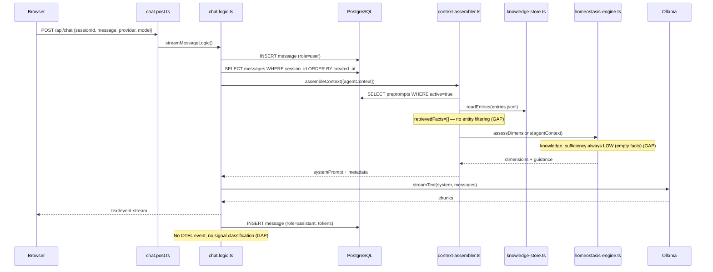
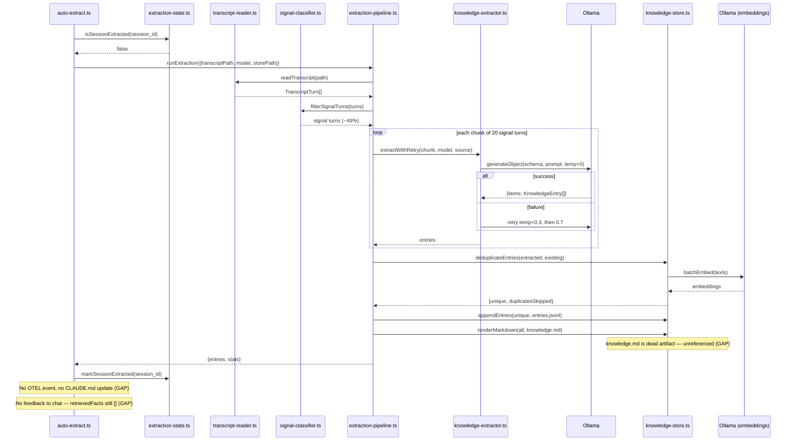
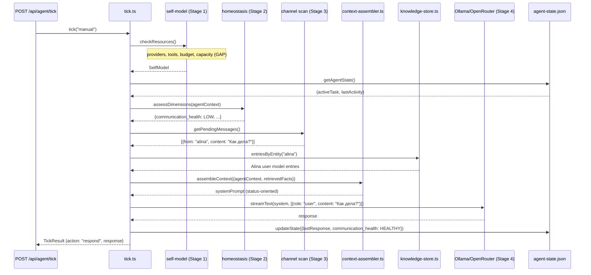

# Phase D: Formalize + Close the Loop

> **For Claude:** REQUIRED SUB-SKILL: Use superpowers:executing-plans to implement this plan task-by-task.

**Goal:** Turn the end-to-end trace into executable integration tests (BDD-style, full integration with real DB + real Ollama), then close the feedback loop so extracted knowledge actually flows into agent behavior.

**Motivation:** The end-to-end trace (`docs/plans/2026-02-13-end-to-end-trace.md`) revealed that the critical problem isn't homeostasis quality — it's that **the feedback loop is broken**. Knowledge gets extracted (Layer 2 works) but `retrievedFacts` is always `[]` in chat (Layer 1). Making homeostasis smarter (L2/L3) won't help when it operates on empty inputs. Close the loop first.

**Previous Phase D plan:** `docs/plans/2026-02-12-phase-d-homeostasis-refinement.md` focused on L2/L3 homeostasis refinement, memory consolidation, and decay. Those items are pushed to Phase E — still valuable, just not the bottleneck.

**Key reference docs:**
- `docs/plans/2026-02-13-end-to-end-trace.md` — golden reference trace (Layers 1-3, cross-cutting X1-X6)
- `docs/plans/2026-02-13-domain-model.md` — real projects, users, data for test scenarios
- `server/memory/knowledge-store.ts` — `entriesByEntity()`, `entriesBySubjectType()` (exist, not wired)
- `server/engine/homeostasis-engine.ts` — current L0-L1 implementation
- `server/functions/chat.logic.ts` — the `retrievedFacts: []` TODO at line 128

**Tech Stack:** Vitest (integration tests), PostgreSQL (real, via Docker), Ollama (real), TypeScript, Mermaid (diagrams)

---

## Two-Part Structure

**Phase D.1: Formalize (Red)** — Tests ARE the spec. Write BDD-style integration tests that assert expected behavior at each trace step. Tests that verify working code pass immediately (green). Tests that assert missing behavior are `it.todo()` — the red phase.

**Phase D.2: Close the Loop (Green)** — Implement the missing wiring to make todos pass. Entity-based retrieval, wire retrievedFacts, tick() function, supersession logic.

---

## Dependency Graph

```
Phase D.1 (Formalize):
  Task 1: Scenario Builder ──→ Task 2: Layer 1 Tests
                            ──→ Task 3: Layer 2 Tests
                            ──→ Task 4: Layer 3 Tests
                              Task 5: Mermaid Diagrams (parallel, no deps)

Phase D.2 (Close the Loop):
  Task 6: Entity-Based Fact Retrieval
      │
      ├──→ Task 7: Wire Retrieval into Chat Path
      │
      └──→ Task 8: tick() Function + Agent State
               │
               └──→ Task 9: Supersession Logic
                      │
                      └──→ Task 10: Clean Up Dead Artifacts
```

D.1 tasks are parallel after Task 1. D.2 tasks are sequential (each builds on previous).

---

## Directory Structure (new files)

```
server/__tests__/integration/
├── helpers/
│   ├── test-world.ts              # Scenario builder + TestWorld interface
│   ├── fixtures.ts                # Knowledge entry factories (fact, preference, userModel)
│   └── setup.ts                   # DB seeding, cleanup, Ollama health check
├── layer1-chat.test.ts            # Developer works on Umka MQTT
├── layer2-extraction.test.ts      # Umka session ends, knowledge extracted
└── layer3-decisions.test.ts       # Alina asks status, tick decides to respond

server/agent/
├── tick.ts                        # tick() function — the integration point
├── agent-state.ts                 # Persistent agent state store
├── types.ts                       # TickResult, AgentState, PendingMessage
└── __tests__/
    └── tick.test.ts               # Unit tests for tick logic

server/memory/
├── fact-retrieval.ts              # Entity-based retrieval from knowledge store
└── __tests__/
    └── fact-retrieval.test.ts     # Unit tests for retrieval

docs/plans/diagrams/
├── layer1-chat.mmd                # Sequence diagram
├── layer2-extraction.mmd          # Sequence diagram
└── layer3-tick.mmd                # Sequence diagram
```

---

## Task 1: Scenario Builder

**Files:**
- Create: `server/__tests__/integration/helpers/test-world.ts`
- Create: `server/__tests__/integration/helpers/fixtures.ts`
- Create: `server/__tests__/integration/helpers/setup.ts`

**Purpose:** Thin helper layer that sets up "worlds" for BDD-style integration tests. Not a framework — just wiring to real implementations with setup/teardown.

### TestWorld Interface

```typescript
interface TestWorld {
  sessionId: string

  // Layer 1: Chat
  sendMessage(content: string): Promise<void>
  roundTrip(content: string): Promise<{ text: string; tokenCount: number }>
  lastMessage(role: "user" | "assistant"): Promise<Message>
  getHistory(): Promise<Message[]>
  assembleContext(): Promise<AssembledContext>

  // Layer 2: Extraction
  readTranscript(): Promise<TranscriptTurn[]>
  classifySignal(turns: TranscriptTurn[]): Promise<TranscriptTurn[]>
  extract(opts?: { force?: boolean }): Promise<ExtractionResult>
  extractOnce(): Promise<ExtractionResult>
  extractAgain(): Promise<ExtractionResult>
  getExtractionState(): Promise<ExtractionState>

  // Layer 3: Tick
  tick(trigger: "manual" | "heartbeat"): Promise<TickResult>

  // Cleanup
  teardown(): Promise<void>
}
```

### Scenario Builder

```typescript
function scenario(name: string) {
  return {
    withSession: (project: string) => /* chain */,
    withPreprompts: (p: PrepromptSeed) => /* chain */,
    withKnowledge: (entries: KnowledgeEntry[]) => /* chain */,
    withKnowledgeFrom: (jsonlPath: string) => /* chain */,
    withEmptyKnowledgeStore: () => /* chain */,
    withTranscript: (path: string) => /* chain */,
    withAgentState: (state: AgentState) => /* chain */,
    withPendingMessage: (msg: PendingMessage) => /* chain */,
    withNoPendingMessages: () => /* chain */,
    seed: async (): Promise<TestWorld> => {
      // 1. Create test DB session (INSERT INTO sessions)
      // 2. Insert preprompts (INSERT INTO preprompts)
      // 3. Write knowledge entries to temp JSONL file
      // 4. Write agent state to temp JSON file
      // 5. Return TestWorld wired to real implementations
    }
  }
}
```

### Fixture Factories

```typescript
// Convenience for creating knowledge entries in tests
function fact(content: string, opts?: Partial<KnowledgeEntry>): KnowledgeEntry
function preference(content: string, opts?: Partial<KnowledgeEntry>): KnowledgeEntry
function procedure(content: string, opts?: Partial<KnowledgeEntry>): KnowledgeEntry
function userModel(entity: string, traits: Record<string, string>): KnowledgeEntry[]
```

### Setup / Teardown

```typescript
// setup.ts
export async function ensureTestDb(): Promise<void>
  // Verify PostgreSQL is reachable, run migrations if needed

export async function ensureOllama(): Promise<void>
  // Health check: GET http://localhost:11434/api/tags
  // Skip tests with clear message if Ollama not running

export async function cleanupTestData(sessionId: string): Promise<void>
  // DELETE FROM messages WHERE session_id = $sessionId
  // DELETE FROM sessions WHERE id = $sessionId
  // Remove temp JSONL files
```

### Acceptance

- `scenario().seed()` creates a working TestWorld
- TestWorld methods call real implementations (not mocks)
- Teardown leaves no test data in DB or filesystem
- Clear skip message when Ollama not running

---

## Task 2: Layer 1 Integration Tests

**File:** `server/__tests__/integration/layer1-chat.test.ts`

**Scenario:** Developer works on Umka MQTT persistence. Real preprompts in DB, real knowledge entries from Umka extraction (259 entries), real Ollama for LLM calls.

```typescript
describe("Layer 1: Developer works on Umka MQTT persistence", () => {
  let world: TestWorld

  beforeAll(async () => {
    world = await scenario("umka-mqtt-dev")
      .withSession("umka")
      .withPreprompts({
        identity: "You are Galatea, a developer agent...",
        constraints: ["Use pnpm in all projects", "Never push directly to main"],
      })
      .withKnowledgeFrom("data/memory/entries.jsonl") // real Umka data
      .seed()
  })

  afterAll(() => world.teardown())

  // --- GREEN: these verify working code ---

  it("stores the developer's message", async () => {
    await world.sendMessage(
      "The MQTT client in Umka needs to persist across hot reloads"
    )
    expect(await world.lastMessage("user")).toMatchObject({
      role: "user",
      content: expect.stringContaining("MQTT"),
    })
  })

  it("retrieves conversation history in order", async () => {
    const history = await world.getHistory()
    expect(history[0].role).toBe("user")
  })

  it("assembles context with identity and constraints from preprompts", async () => {
    const ctx = await world.assembleContext()
    expect(ctx.systemPrompt).toContain("CONSTRAINTS")
    expect(ctx.systemPrompt).toContain("IDENTITY")
    expect(ctx.metadata.prepromptsLoaded).toBeGreaterThan(0)
  })

  it("detects knowledge gap when no relevant facts retrieved", async () => {
    const ctx = await world.assembleContext()
    expect(ctx.metadata.homeostasisGuidanceIncluded).toBe(true)
    expect(ctx.systemPrompt).toContain("SELF-REGULATION")
  })

  it("gets a response from the LLM with token counts", async () => {
    const response = await world.roundTrip(
      "The MQTT client in Umka needs to persist across hot reloads"
    )
    expect(response.text).toBeTruthy()
    expect(response.tokenCount).toBeGreaterThan(0)
  })

  it("stores assistant response in DB", async () => {
    const msg = await world.lastMessage("assistant")
    expect(msg.role).toBe("assistant")
    expect(msg.content).toBeTruthy()
  })

  // --- RED (todo): these assert missing behavior ---

  it.todo("retrieves MQTT facts from knowledge store when message mentions MQTT")
  // Given: store has MQTT facts with about.entity="umka"
  // When: developer asks about MQTT
  // Then: retrievedFacts includes MQTT entries
  // Then: knowledge_sufficiency is HEALTHY (not LOW)

  it.todo("does NOT retrieve Alina's user model for developer chat")
  // Given: store has entries about Alina (about.entity="alina", type="user")
  // When: developer (not Alina) chats about MQTT
  // Then: Alina's entries not in retrievedFacts

  it.todo("emits OTEL event after response delivered")
  // Given: OTEL collector running
  // When: response delivered
  // Then: event store has chat.response_delivered event

  it.todo("runs signal classification on the user's message in real-time")
  // Given: user sends high-signal message ("I prefer using pnpm")
  // When: message processed
  // Then: signal classified and logged (for real-time learning, not just batch)
})
```

### Acceptance

- 6 green tests pass with real DB + real Ollama
- 4 todo tests document the feedback loop gap
- Test file reads as a behavioral specification
- `pnpm test:integration` runs separately from `pnpm test`

---

## Task 3: Layer 2 Integration Tests

**File:** `server/__tests__/integration/layer2-extraction.test.ts`

**Scenario:** Umka session ends. Extraction pipeline processes the transcript, stores knowledge, updates state.

```typescript
describe("Layer 2: Umka session ends, knowledge extracted", () => {
  let world: TestWorld

  beforeAll(async () => {
    world = await scenario("umka-session-end")
      .withTranscript("server/memory/__tests__/fixtures/sample-session.jsonl")
      .withEmptyKnowledgeStore()
      .seed()
  })

  afterAll(() => world.teardown())

  // --- GREEN: these verify working code ---

  it("reads transcript and filters noise from signal", async () => {
    const turns = await world.readTranscript()
    const signal = await world.classifySignal(turns)
    expect(signal.length).toBeLessThan(turns.length)
    expect(signal.length).toBeGreaterThan(0)
  })

  it("extracts knowledge entries with valid schema", async () => {
    const result = await world.extract()
    expect(result.entries.length).toBeGreaterThan(0)
    for (const entry of result.entries) {
      expect(entry).toMatchObject({
        id: expect.any(String),
        type: expect.stringMatching(
          /^(fact|preference|decision|rule|procedure|correction)$/
        ),
        content: expect.any(String),
        confidence: expect.any(Number),
        evidence: expect.any(String),
        source: expect.stringContaining("session:"),
      })
    }
  })

  it("deduplicates on re-extraction with force", async () => {
    const result = await world.extract({ force: true })
    expect(result.stats.duplicatesSkipped).toBeGreaterThan(0)
  })

  it("records extraction state after completion", async () => {
    const state = await world.getExtractionState()
    expect(state.sessions).toHaveProperty(world.sessionId)
    expect(state.sessions[world.sessionId].entriesCount).toBeGreaterThan(0)
  })

  it("skips already-extracted session", async () => {
    const result = await world.extractAgain()
    expect(result.stats.skippedAlreadyExtracted).toBe(true)
    expect(result.entries).toHaveLength(0)
  })

  // --- RED (todo): these assert missing behavior ---

  it.todo("extracted facts appear in next chat's context")
  // THE FEEDBACK LOOP TEST
  // Given: extraction just completed with MQTT facts
  // When: developer starts new chat asking about MQTT
  // Then: assembleContext includes the freshly extracted facts
  // Then: knowledge_sufficiency changes from LOW to HEALTHY

  it.todo("superseded entries filtered from context")
  // Given: entry A exists, entry B created with supersededBy pointing to A
  // When: assembleContext runs
  // Then: only B appears, A is filtered out

  it.todo("OTEL event emitted on extraction completion")
  // Given: OTEL collector running
  // When: extraction completes
  // Then: event store has extraction.complete event with entriesCount

  it.todo("high-confidence entries consolidated to CLAUDE.md")
  // Given: entry seen 3+ times with avg confidence >= 0.85
  // When: consolidation runs after extraction
  // Then: entry appears in CLAUDE.md
})
```

### Acceptance

- 5 green tests pass with real Ollama extraction
- 4 todo tests document missing feedback loop and lifecycle
- The feedback loop test ("extracted facts appear in next chat's context") is the single most important assertion in the whole suite

---

## Task 4: Layer 3 Integration Tests

**File:** `server/__tests__/integration/layer3-decisions.test.ts`

**Scenario:** Alina (Umka PM) asks project status while developer is mid-session. Tests the tick() function's decision-making: homeostasis assessment, user model retrieval, context assembly, action selection.

No Discord I/O tested — only the decisions tick() makes.

```typescript
describe("Layer 3: Alina asks project status, agent decides to respond", () => {
  let world: TestWorld

  beforeAll(async () => {
    world = await scenario("alina-asks-status")
      .withSession("umka")
      .withKnowledgeFrom("data/memory/entries.jsonl")
      .withAgentState({
        activeTask: { project: "umka", topic: "MQTT persistence", channel: "web" },
        lastActivity: new Date(),
      })
      .withPendingMessage({
        from: "alina",
        channel: "discord",
        content: "Как дела? Что с проектом?",
        receivedAt: new Date(Date.now() - 5 * 60_000),
      })
      .seed()
  })

  afterAll(() => world.teardown())

  // --- GREEN (once tick() exists): tick decision tests ---

  it("tick detects pending message and assesses communication_health as LOW", async () => {
    const tick = await world.tick("manual")
    expect(tick.homeostasis.communication_health).toBe("LOW")
  })

  it("tick retrieves Alina's user model from knowledge store", async () => {
    const tick = await world.tick("manual")
    const alinaFacts = tick.retrievedFacts.filter(
      (f) => f.about?.entity === "alina"
    )
    expect(alinaFacts.length).toBeGreaterThan(0)
  })

  it("tick assembles status-oriented context with active task info", async () => {
    const tick = await world.tick("manual")
    expect(tick.context.systemPrompt).toContain("MQTT persistence")
  })

  it("tick decides to respond, not ignore", async () => {
    const tick = await world.tick("manual")
    expect(tick.action).toBe("respond")
    expect(tick.action_target).toMatchObject({
      channel: "discord",
      to: "alina",
    })
  })

  it("LLM produces response using assembled context", async () => {
    const tick = await world.tick("manual")
    expect(tick.response.text).toBeTruthy()
  })

  it("communication_health returns to HEALTHY after responding", async () => {
    await world.tick("manual")
    const next = await world.tick("manual")
    expect(next.homeostasis.communication_health).toBe("HEALTHY")
    expect(next.pendingMessages).toHaveLength(0)
  })

  it("tick with no pending messages and active task stays idle", async () => {
    const world2 = await scenario("working-no-messages")
      .withSession("umka")
      .withAgentState({
        activeTask: { project: "umka", topic: "MQTT" },
        lastActivity: new Date(),
      })
      .withNoPendingMessages()
      .seed()
    const tick = await world2.tick("manual")
    expect(tick.action).toBe("idle")
    expect(tick.homeostasis.productive_engagement).toBe("HEALTHY")
    await world2.teardown()
  })

  // --- RED (todo): self-model and powered-down ---

  it.todo("self-model reports available providers before LLM call")
  // Given: Ollama running, OpenRouter configured
  // When: tick runs stage 1 (self-model)
  // Then: selfModel.availableProviders includes both

  it.todo("powered-down mode produces template response when no LLM available")
  // Given: Ollama stopped, OpenRouter rate-limited
  // When: tick runs, reaches stage 4
  // Then: response is template-based, not LLM-generated
  // Then: response mentions active task and constraints
})
```

### Note on Layer 3 test status

Layer 3 tests depend on `tick()` existing (`server/agent/tick.ts`). This function doesn't exist yet — it's Task 8 in Phase D.2. So Layer 3 tests will be written in D.1 but will all fail until D.2 Task 8 is complete. This is intentional: the tests define the spec for tick() before we implement it.

### Acceptance

- 7 tests define tick() behavior (all red until Task 8)
- 2 todo tests for self-model and powered-down mode
- Tests verify decisions, not I/O (no Discord mocking)
- Negative case: idle tick with no messages

---

## Task 5: Mermaid Diagrams

**Files:**
- Create: `docs/plans/diagrams/layer1-chat.mmd`
- Create: `docs/plans/diagrams/layer2-extraction.mmd`
- Create: `docs/plans/diagrams/layer3-tick.mmd`

**Purpose:** Visual sanity check. Not the source of truth (tests are), but useful for reviewing flow and spotting missed interactions.

### Conventions

- Gaps marked with `Note` annotations matching `it.todo()` tests
- When a todo becomes green, remove the corresponding `(GAP)` note
- Participants match the actual TypeScript modules

### Layer 1 Diagram



### Layer 2 Diagram



### Layer 3 Diagram



### Acceptance

- 3 diagrams rendered and committed
- GAP notes match `it.todo()` tests
- Diagrams reviewed for flow correctness (sanity check)

---

## Task 6: Entity-Based Fact Retrieval

**Files:**
- Create: `server/memory/fact-retrieval.ts`
- Create: `server/memory/__tests__/fact-retrieval.test.ts`

**Purpose:** Given a user message, retrieve relevant knowledge entries by matching entities in the message against the `about` field in the knowledge store. This is the missing piece that populates `retrievedFacts`.

### Implementation

```typescript
// server/memory/fact-retrieval.ts

import { readEntries, entriesByEntity } from "./knowledge-store"
import type { KnowledgeEntry } from "./types"

interface RetrievalResult {
  entries: KnowledgeEntry[]
  matchedEntities: string[]
}

/**
 * Retrieve knowledge entries relevant to a message.
 *
 * Strategy (hybrid, per domain model recommendations):
 * 1. Extract entity mentions from message (simple keyword matching)
 * 2. Retrieve entries where about.entity matches any mentioned entity
 * 3. Retrieve domain-tagged entries matching message keywords
 * 4. Sort by confidence descending
 * 5. Limit to tokenBudget (approximate)
 */
export async function retrieveRelevantFacts(
  message: string,
  storePath?: string,
  opts?: { maxEntries?: number }
): Promise<RetrievalResult> {
  const entries = await readEntries(storePath)
  const active = entries.filter((e) => !e.supersededBy)
  const entities = extractEntityMentions(message, active)

  const relevant: KnowledgeEntry[] = []
  const seen = new Set<string>()

  // Pass 1: entries matching mentioned entities
  for (const entity of entities) {
    for (const entry of entriesByEntity(active, entity)) {
      if (!seen.has(entry.id)) {
        relevant.push(entry)
        seen.add(entry.id)
      }
    }
  }

  // Pass 2: domain-tagged entries matching message keywords
  const keywords = extractKeywords(message)
  for (const entry of active) {
    if (seen.has(entry.id)) continue
    if (entry.about?.type === "domain" && keywordOverlap(keywords, entry)) {
      relevant.push(entry)
      seen.add(entry.id)
    }
  }

  // Sort by confidence, limit
  relevant.sort((a, b) => b.confidence - a.confidence)
  const max = opts?.maxEntries ?? 20
  return {
    entries: relevant.slice(0, max),
    matchedEntities: entities,
  }
}

function extractEntityMentions(
  message: string,
  entries: KnowledgeEntry[]
): string[] {
  // Collect all known entities from the store
  const knownEntities = new Set<string>()
  for (const e of entries) {
    if (e.about?.entity) knownEntities.add(e.about.entity.toLowerCase())
    for (const ent of e.entities ?? []) knownEntities.add(ent.toLowerCase())
  }

  // Match against message
  const msgLower = message.toLowerCase()
  return [...knownEntities].filter((entity) => msgLower.includes(entity))
}

function extractKeywords(message: string): Set<string> {
  return new Set(
    message.toLowerCase().split(/\W+/).filter((w) => w.length > 3)
  )
}

function keywordOverlap(keywords: Set<string>, entry: KnowledgeEntry): boolean {
  const entryWords = new Set(
    entry.content.toLowerCase().split(/\W+/).filter((w) => w.length > 3)
  )
  let overlap = 0
  for (const kw of keywords) {
    if (entryWords.has(kw)) overlap++
  }
  return overlap >= 2
}
```

### Tests

```typescript
// Unit tests with fixture data
describe("Fact Retrieval", () => {
  it("retrieves entries matching entity in message", async () => {
    // Message mentions "mqtt", store has entries about.entity="umka" with MQTT content
    const result = await retrieveRelevantFacts(
      "The MQTT client needs to persist",
      fixturePath
    )
    expect(result.entries.length).toBeGreaterThan(0)
    expect(result.matchedEntities).toContain("mqtt")
  })

  it("does not retrieve unrelated entities", async () => {
    const result = await retrieveRelevantFacts(
      "The MQTT client needs to persist",
      fixturePath
    )
    const alinaEntries = result.entries.filter(
      (e) => e.about?.entity === "alina"
    )
    expect(alinaEntries).toHaveLength(0)
  })

  it("includes domain-tagged entries matching keywords", async () => {
    const result = await retrieveRelevantFacts(
      "How should I handle TypeScript strict mode?",
      fixturePath
    )
    const domainEntries = result.entries.filter(
      (e) => e.about?.type === "domain"
    )
    expect(domainEntries.length).toBeGreaterThanOrEqual(0) // may or may not exist
  })

  it("sorts by confidence descending", async () => {
    const result = await retrieveRelevantFacts("MQTT client", fixturePath)
    for (let i = 1; i < result.entries.length; i++) {
      expect(result.entries[i].confidence).toBeLessThanOrEqual(
        result.entries[i - 1].confidence
      )
    }
  })

  it("respects maxEntries limit", async () => {
    const result = await retrieveRelevantFacts("MQTT", fixturePath, {
      maxEntries: 5,
    })
    expect(result.entries.length).toBeLessThanOrEqual(5)
  })
})
```

### Acceptance

- Retrieves entities mentioned in message
- Filters out unrelated entities (Alina not in MQTT results)
- Sorts by confidence
- Respects maxEntries limit

---

## Task 7: Wire Retrieval into Chat Path

**Files:**
- Modify: `server/functions/chat.logic.ts`

**Purpose:** Replace `retrievedFacts: []` with actual entity-based retrieval. This closes the feedback loop.

### Change

```typescript
// server/functions/chat.logic.ts — streamMessageLogic (and sendMessageLogic)

// BEFORE (line 128):
retrievedFacts: [], // TODO: implement fact retrieval in Phase D

// AFTER:
retrievedFacts: (await retrieveRelevantFacts(message)).entries,
```

One line change. The infrastructure already handles retrievedFacts downstream — homeostasis reads it, context assembler renders it. The only missing piece was this call.

### What this enables

Once wired:
- `knowledge_sufficiency` sensor sees real facts → can assess HEALTHY when relevant knowledge exists
- Homeostasis guidance changes based on actual knowledge state
- Context assembler includes relevant facts in LEARNED KNOWLEDGE section
- The feedback loop closes: extract → store → retrieve → use

### Integration test flips

After this change, these Layer 1 todos become green:
- "retrieves MQTT facts from knowledge store when message mentions MQTT"
- "does NOT retrieve Alina's user model for developer chat"

And from Layer 2:
- "extracted facts appear in next chat's context"

### Acceptance

- `retrievedFacts` populated with entity-matched entries
- Layer 1 + Layer 2 feedback loop integration tests pass
- No regression in existing tests

---

## Task 8: tick() Function + Agent State

**Files:**
- Create: `server/agent/tick.ts`
- Create: `server/agent/agent-state.ts`
- Create: `server/agent/types.ts`
- Create: `server/routes/api/agent/tick.post.ts`
- Create: `server/agent/__tests__/tick.test.ts`

**Purpose:** The integration point for all subsystems. A function that runs the four-stage pipeline: self-model → homeostasis → channel scan → action.

### Types

```typescript
// server/agent/types.ts

interface AgentState {
  activeTask?: {
    project: string
    topic: string
    channel: string
    startedAt: string
  }
  lastActivity: string
  pendingMessages: PendingMessage[]
}

interface PendingMessage {
  from: string
  channel: string
  content: string
  receivedAt: string
}

interface TickResult {
  homeostasis: HomeostasisState
  retrievedFacts: KnowledgeEntry[]
  context: AssembledContext
  selfModel: SelfModel
  pendingMessages: PendingMessage[]
  action: "respond" | "extract" | "idle"
  action_target?: { channel: string; to?: string }
  response?: { text: string }
}

interface SelfModel {
  availableProviders: string[]
  // Expanded in Phase E (X6 self-model)
}
```

### Implementation

```typescript
// server/agent/tick.ts

export async function tick(
  trigger: "manual" | "heartbeat" | "webhook"
): Promise<TickResult> {
  // Stage 1: Self-model (pure state reads — always runs)
  const selfModel = await checkSelfModel()

  // Stage 2: Read state + assess homeostasis
  const state = await getAgentState()
  const pending = state.pendingMessages

  // Stage 3: Decide what to act on
  if (pending.length > 0) {
    const msg = pending[0] // oldest first
    const facts = await retrieveRelevantFacts(msg.content)
    const userFacts = await retrieveUserModel(msg.from)

    const agentContext: AgentContext = {
      sessionId: `tick-${Date.now()}`,
      currentMessage: msg.content,
      messageHistory: [],
      retrievedFacts: [...facts.entries, ...userFacts],
      lastMessageTime: new Date(msg.receivedAt),
      hasAssignedTask: !!state.activeTask,
    }

    const dimensions = assessDimensions(agentContext)
    const context = await assembleContext({ agentContext })

    // Stage 4: LLM action (only if provider available)
    if (selfModel.availableProviders.length > 0) {
      const model = getModel(/* best available provider */)
      const result = await generateText({
        model,
        system: context.systemPrompt,
        messages: [{ role: "user", content: msg.content }],
      })

      // Update state
      await removePendingMessage(msg)

      return {
        homeostasis: dimensions,
        retrievedFacts: [...facts.entries, ...userFacts],
        context,
        selfModel,
        pendingMessages: pending,
        action: "respond",
        action_target: { channel: msg.channel, to: msg.from },
        response: { text: result.text },
      }
    }
  }

  // No pending messages or no LLM → idle
  const agentContext: AgentContext = {
    sessionId: `tick-${Date.now()}`,
    currentMessage: "",
    messageHistory: [],
    retrievedFacts: [],
    hasAssignedTask: !!state.activeTask,
  }

  return {
    homeostasis: assessDimensions(agentContext),
    retrievedFacts: [],
    context: await assembleContext({ agentContext }),
    selfModel,
    pendingMessages: pending,
    action: "idle",
  }
}
```

### API Endpoint

```typescript
// server/routes/api/agent/tick.post.ts
export default defineEventHandler(async () => {
  const result = await tick("manual")
  return result
})
```

### Agent State Store

```typescript
// server/agent/agent-state.ts
// Simple JSON file: data/agent/state.json
// Read/write with file locking (future concern)

export async function getAgentState(): Promise<AgentState>
export async function updateAgentState(patch: Partial<AgentState>): Promise<void>
export async function addPendingMessage(msg: PendingMessage): Promise<void>
export async function removePendingMessage(msg: PendingMessage): Promise<void>
```

### Acceptance

- `tick("manual")` runs all 4 stages
- Returns TickResult with homeostasis, facts, action
- `POST /api/agent/tick` exposes it as API
- Layer 3 integration tests pass (all 7 green)

---

## Task 9: Supersession Logic

**Files:**
- Modify: `server/memory/knowledge-store.ts`
- Add tests: `server/memory/__tests__/knowledge-store.test.ts`

**Purpose:** Add a function that marks an entry as superseded by a newer entry. The `supersededBy` field already exists and is filtered everywhere — but nothing populates it.

### Implementation

```typescript
// Add to knowledge-store.ts

export async function supersedeEntry(
  oldEntryId: string,
  newEntryId: string,
  storePath?: string
): Promise<void> {
  const entries = await readEntries(storePath)
  const updated = entries.map((e) =>
    e.id === oldEntryId ? { ...e, supersededBy: newEntryId } : e
  )
  // Rewrite the store (entries are small enough for full rewrite)
  await writeEntries(updated, storePath)
}
```

### Tests

```typescript
it("marks entry as superseded", async () => {
  // Create two entries, supersede the first
  await supersedeEntry("entry-1", "entry-2", testStorePath)
  const entries = await readEntries(testStorePath)
  const old = entries.find((e) => e.id === "entry-1")
  expect(old?.supersededBy).toBe("entry-2")
})

it("superseded entries excluded from active set", async () => {
  const entries = await readEntries(testStorePath)
  const active = entries.filter((e) => !e.supersededBy)
  expect(active.find((e) => e.id === "entry-1")).toBeUndefined()
})
```

### Acceptance

- `supersedeEntry()` writes `supersededBy` field
- Existing filter code (`!e.supersededBy`) already handles filtering
- Layer 2 todo "superseded entries filtered from context" passes

---

## Task 10: Clean Up Dead Artifacts

**Files:**
- Modify: `server/memory/extraction-pipeline.ts` (remove knowledge.md rendering)
- Delete: `data/memory/knowledge.md` (if exists)
- Modify: `.gitignore` (remove knowledge.md reference if any)

**Purpose:** The trace identified `knowledge.md` as a dead artifact — rendered after extraction but never referenced by the context assembler, CLAUDE.md, or anything else. Remove it to reduce confusion.

### What to do

1. Remove the `renderMarkdown()` call from `extraction-pipeline.ts`
2. Keep the `renderMarkdown()` function in `knowledge-store.ts` (may be useful for debugging)
3. Remove any generated `knowledge.md` files
4. Update extraction pipeline tests that assert `knowledge.md` existence

### Acceptance

- Extraction pipeline no longer renders knowledge.md
- No test failures
- `renderMarkdown()` function retained but not called in hot path

---

## Verification Checklist

After all 10 tasks:

```bash
# Unit tests pass
pnpm test

# Integration tests run (requires Docker + Ollama)
pnpm test:integration

# TypeScript compiles
pnpm exec tsc --noEmit

# Biome lint
pnpm biome check .
```

### Integration test status after D.1 (Tasks 1-5)

```
Layer 1:  6 green, 4 todo
Layer 2:  5 green, 4 todo
Layer 3:  0 green (tick doesn't exist yet), 7 red, 2 todo
```

### Integration test status after D.2 (Tasks 6-10)

```
Layer 1:  8 green, 2 todo (OTEL, signal classification)
Layer 2:  7 green, 2 todo (OTEL, CLAUDE.md consolidation)
Layer 3:  7 green, 2 todo (self-model, powered-down)
```

Remaining todos are Phase E work (OTEL app events, consolidation, self-model).

---

## What Phase D Enables

After D.2, the system has a closed feedback loop:
1. **Extract** → knowledge stored from session transcripts (Layer 2, existing)
2. **Retrieve** → entity-based fact retrieval matches knowledge to messages (NEW)
3. **Use** → context assembler includes relevant facts in system prompt (existing, now fed)
4. **Assess** → homeostasis sees real facts, produces accurate guidance (existing, now accurate)
5. **Decide** → tick() uses homeostasis + knowledge to choose actions (NEW)

The agent actually learns and uses what it learned. Homeostasis guidance becomes meaningful because it operates on real data instead of empty inputs.

---

## Revised Phase E (pushed from old Phase D)

**Goal:** Make homeostasis smarter, add memory lifecycle, self-model.

1. Fix L1 edge cases (keyword stemming, stuck detection)
2. L2 LLM assessment (certainty_alignment, knowledge_application)
3. L3 meta-assessment prototype
4. Memory consolidation (high-confidence → CLAUDE.md)
5. Memory decay (confidence reduction over time)
6. Self-model + powered-down mode (X6 cross-cutting)
7. Performance metrics (L0 cache hit rate, L1/L2 latency)
8. App-level OTEL events (chat, extraction, tick)

## Revised Phase F (pushed from old Phase E)

**Goal:** Skills, heartbeat loop, visualization.

1. SKILL.md auto-generation from 3+ repeated procedures
2. Heartbeat loop: `setInterval(() => tick("heartbeat"), 30_000)`
3. Homeostasis dashboard (React, real-time dimensions)
4. Memory browser (search, edit knowledge entries)
5. Safety system (knowledge store poisoning guard, pre/post filters)
